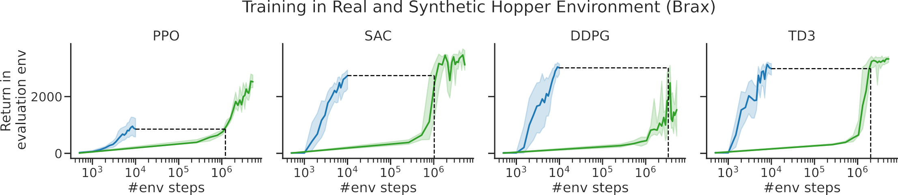

# Synthetic Gymnax
## 💡 Make a one-line change ...
<table>
<tr>
<th>Simply replace</th>
<th>by</th>
</tr>
<tr>
<td>
  
```python
import gymnax
env, params = gymnax.make("CartPole-v1")

...  # your training code
```
</td>
<td>

```python
import gymnax, synthetic_gymnax
env, params = gymnax.make("Synthetic-CartPole-v1")
# add 'synthetic' to env:  ^^^^^^^^^^
...  # your training code
```
</td>
</tr>
</table>

## 💨 ... and enjoy fast training. 

The synthetic environments are meta-learned to train agents within 10k time steps. 
This can be much faster than training in the real environment, even when using tuned hyperparameters!


- 🟩 **Real environment** training, using tuned hyperparameters (IQM of 5 training runs)
- 🟦 **Synthetic environment** training, using any reasonable hyperparameters (IQM performance of 20 training runs with random HP configurations)


## 🏅 Performance of agents after training for 10k synthetic steps 
<table>
  <thead>
    <tr>
      <th colspan=6>Classic control: 10k synthetic 🦶</th>
    </th>
    <tr>
      <th>Environment</th>
      <th>PPO</th>
      <th>SAC</th>
      <th>DQN</th>
      <th>DDPG</th>
      <th>TD3</th>
    </tr>
  </thead>
  <tbody>
    <tr>
      <td>Synthetic-Acrobot-v1</td>
      <td>-84.1</td>
      <td>-85.3</td>
      <td>-82.6</td>
      <td>-</td>
      <td>-</td>
    </tr>
    <tr>
      <td>Synthetic-CartPole-v1</td>
      <td>500.0</td>
      <td>500.0</td>
      <td>500.0</td>
      <td>-</td>
      <td>-</td>
    </tr>
    <tr>
      <td>Synthetic-Mountaincar-v0</td>
      <td>-181.8</td>
      <td>-170.1</td>
      <td>-118.4</td>
      <td>-</td>
      <td>-</td>
    </tr>
    <tr>
      <td>Synthetic-CountinuousMountainCar-v0</td>
      <td>66.9</td>
      <td>91.1</td>
      <td>-</td>
      <td>97.6</td>
      <td>97.5</td>
    </tr>
    <tr>
      <td>Synthetic-Pendulum-v1</td>
      <td>-205.4</td>
      <td>-188.3</td>
      <td>-</td>
      <td>-164.3</td>
      <td>-168.5</td>
    </tr>
  </tbody>
</table>
<table>
  <thead>
    <tr>
      <th colspan=9>Brax: 10k synthetic, 5m real 🦶</th>
    </th>
    <tr>
      <th rowspan=2>Environment</th>
      <th colspan=2>PPO</th>
      <th colspan=2>SAC</th>
      <th colspan=2>DDPG</th>
      <th colspan=2>TD3</th>
    </tr>
    <tr>
      <th>Synthetic</th>
      <th>Real</th>
      <th>Synthetic</th>
      <th>Real</th>
      <th>Synthetic</th>
      <th>Real</th>
      <th>Synthetic</th>
      <th>Real</th>
    </tr>
  </thead>
  <tbody>
    <tr>
      <td>halfcheetah</td>
      <td>1657.4</td>
      <td><!-- b -->3487.1<!-- /b --></td>
      <td>5810.4</td>
      <td><!-- b -->7735.5<!-- /b --></td>
      <td><!-- b -->6162.4<!-- /b --></td>
      <td>3263.3</td>
      <td>6555.8</td>
      <td><!-- b -->13213.5<!-- /b --></td>
    </tr>
    <tr>
      <td>hopper</td>
      <td>853.5</td>
      <td><!-- b -->2521.9<!-- /b --></td>
      <td>2738.8</td>
      <td><!-- b -->3119.4<!-- /b --></td>
      <td><!-- b -->3012.4<!-- /b --></td>
      <td>1536.0</td>
      <td>2985.3</td>
      <td><!-- b -->3325.8<!-- /b --></td>
    </tr>
    <tr>
      <td>humanoidstandup</td>
      <td>13356.1</td>
      <td><!-- b -->17243.5<!-- /b --></td>
      <td>21105.2</td>
      <td><!-- b -->23808.1<!-- /b --></td>
      <td>21039.0</td>
      <td><!-- b -->24944.8<!-- /b --></td>
      <td>20372.0</td>
      <td><!-- b -->28376.2<!-- /b --></td>
    </tr>
    <tr>
      <td>swimmer</td>
      <td><!-- b -->348.5<!-- /b --></td>
      <td>83.6</td>
      <td><!-- b -->361.6<!-- /b --></td>
      <td>124.8</td>
      <td><!-- b -->365.1<!-- /b --></td>
      <td>348.5</td>
      <td><!-- b -->365.4<!-- /b --></td>
      <td>232.2</td>
    </tr>
    <tr>
      <td>walker2d</td>
      <td>858.3</td>
      <td><!-- b -->2039.6<!-- /b --></td>
      <td>1323.1</td>
      <td><!-- b -->4140.1<!-- /b --></td>
      <td><!-- b -->1304.3<!-- /b --></td>
      <td>698.3</td>
      <td>1321.8</td>
      <td><!-- b -->4605.8<!-- /b --></td>
    </tr>
  </tbody>
</table>


## 💫Replicating our results
We provide the configurations used in meta-training the checkpoints for synthetic environments in `synthetic_gymnax/checkpoints/*environment*/config.yaml`. They can be used with the meta-learning script by calling e.g.
```
python examples/metalearn_synthenv.py --config synthetic_gymnax/checkpoints/hopper/config.yaml
```

Please note that when installing via pip, the configs are not bundled with the package. 
Please clone the repository to get them.


## ✍ Citing and more information
If you use the provided synthetic environments in your work, please cite us as
```
@article{liesen2024discovering,
      title={Discovering Minimal Reinforcement Learning Environments}, 
      author={Jarek Liesen and Chris Lu and Andrei Lupu and Jakob N. Foerster and Henning Sprekeler and Robert T. Lange},
      year={2024},
      eprint={2406.12589},
      archivePrefix={arXiv},
}
```
